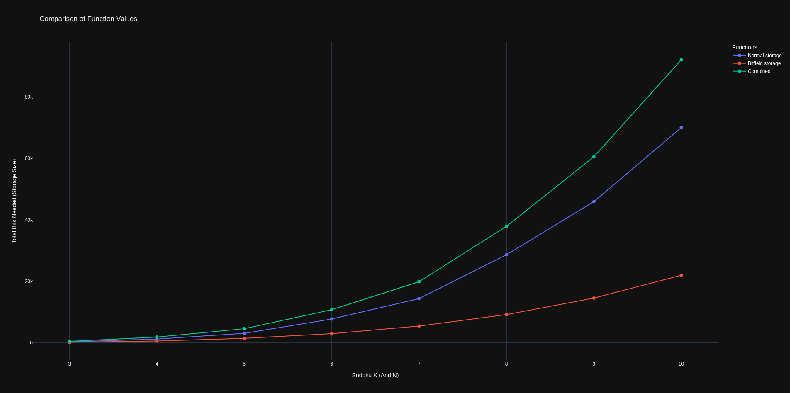

# Tools

## Board Storage size analysis

| k | f(k)    | g(k)  | a(k)    |
|---|---------|-------|---------|
| 0 | 324.0   | 216   | 540.0   |
| 1 | 1280.0  | 640   | 1920.0  |
| 2 | 3125.0  | 1500  | 4625.0  |
| 3 | 7776.0  | 3024  | 10800.0 |
| 4 | 14406.0 | 5488  | 19894.0 |
| 5 | 28672.0 | 9216  | 37888.0 |
| 6 | 45927.0 | 14580 | 60507.0 |
| 7 | 70000.0 | 22000 | 92000.0 |
